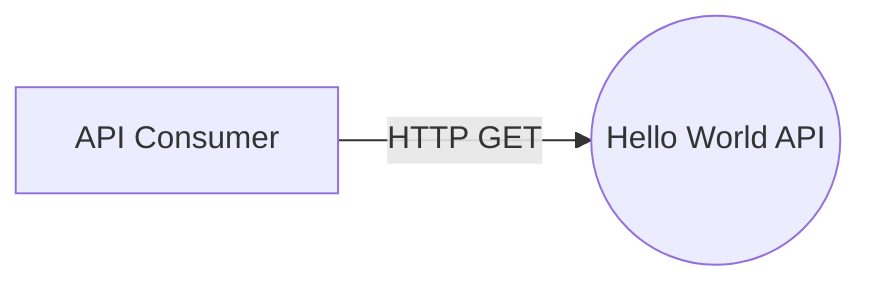
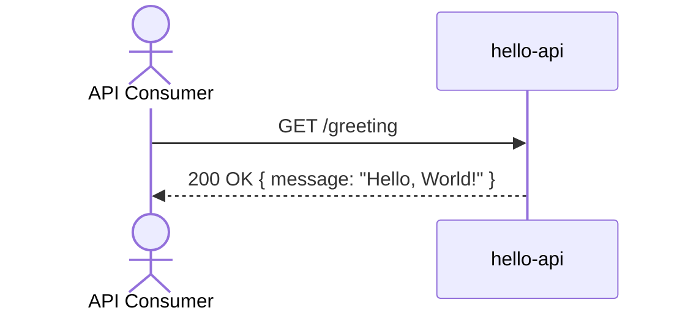

# Hello World API — Design

## Overview

A single public service, `hello-api`, exposes one endpoint that returns a static "Hello, World!" greeting. There is no persistence, no authentication, and no other component — the entire system is one lightweight reachability check any client can call directly over the internet.

## Context (C1)

## Domain model (ER)

No persistent entities exist in this system — the response is a static, stateless greeting with no stored data.

## Key flows

